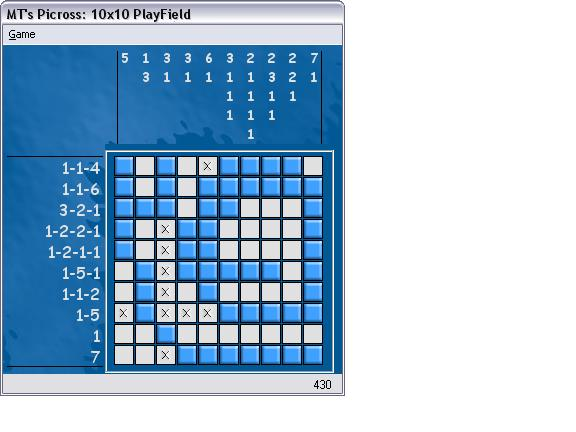



## MT's Picross Ver 0\.4

### Description

This is a simple clone of Mario's Picross that I decided to make. Mario's Picross (or in this case, MT's Picross) is a simple puzzle game where you have to uncover a hidden picture using the clues around the grid. Includes stage creator and the ability to download stages off the net. Vote please, I worked hard on this.
 
### More Info
 

             |
---                |---
**Submitted On**   |2002-12-12 17:33:32
**By**             |[MaskingTape](https://github.com/Planet-Source-Code/PSCIndex/blob/master/ByAuthor/maskingtape.md)
**Level**          |Beginner
**User Rating**    |5.0 (10 globes from 2 users)
**Compatibility**  |VB 6\.0
**Category**       |[Games](https://github.com/Planet-Source-Code/PSCIndex/blob/master/ByCategory/games__1-38.md)
**World**          |[Visual Basic](https://github.com/Planet-Source-Code/PSCIndex/blob/master/ByWorld/visual-basic.md)
**Archive File**   |[MT's\_Picro15120712122002\.zip](https://github.com/Planet-Source-Code/maskingtape-mt-s-picross-ver-0-4__1-41528/archive/master.zip)

